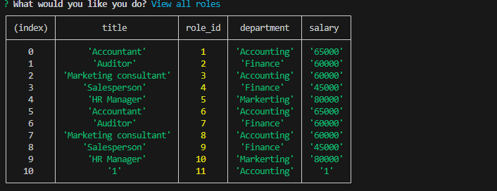

# employee-tracker
https://github.com/imbanu1/employee-tracker
https://www.loom.com/share/9394842ffdc8464b910d0a4cc8a63599?sid=ac55f4de-b097-4ea4-bf44-02b6f2324d83

GIVEN a command-line application that accepts user input
WHEN I start the application
THEN I am presented with the following options: view all departments, view all roles, view all employees, add a department, add a role, add an employee, and update an employee role

WHEN I choose to view all departments
THEN I am presented with a formatted table showing department names and department ids

WHEN I choose to view all roles
THEN I am presented with the job title, role id, the department that role belongs to, and the salary for that role

WHEN I choose to view all employees
THEN I am presented with a formatted table showing employee data, including employee ids, first names, last names, job titles, departments, salaries, and managers that the employees report to

WHEN I choose to add a department
THEN I am prompted to enter the name of the department and that department is added to the database

WHEN I choose to add a role
THEN I am prompted to enter the name, salary, and department for the role and that role is added to the database

WHEN I choose to add an employee
THEN I am prompted to enter the employee’s first name, last name, role, and manager, and that employee is added to the database

WHEN I choose to update an employee role
THEN I am prompted to select an employee to update and their new role and this information is updated in the database